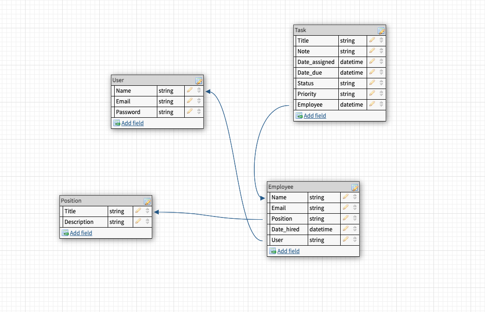
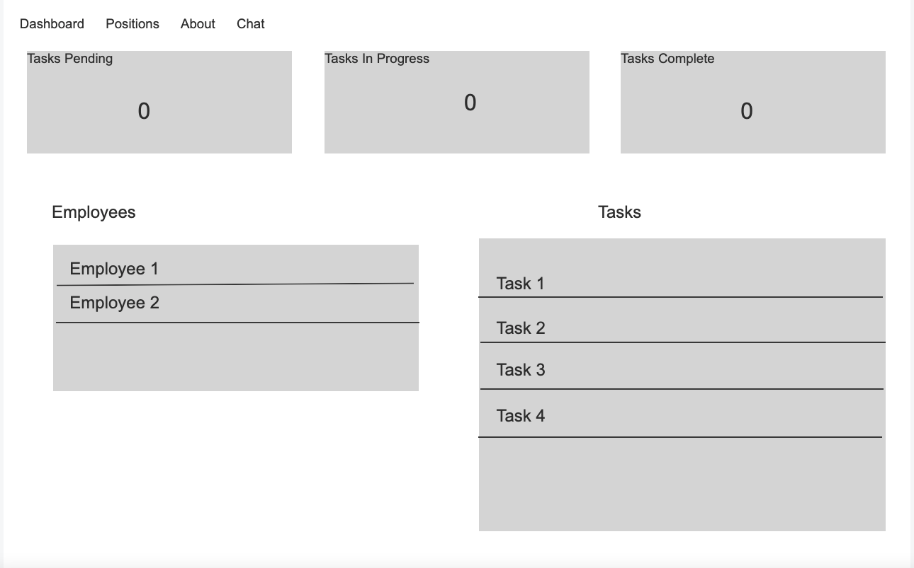
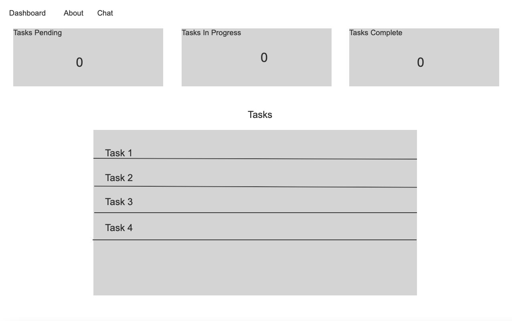
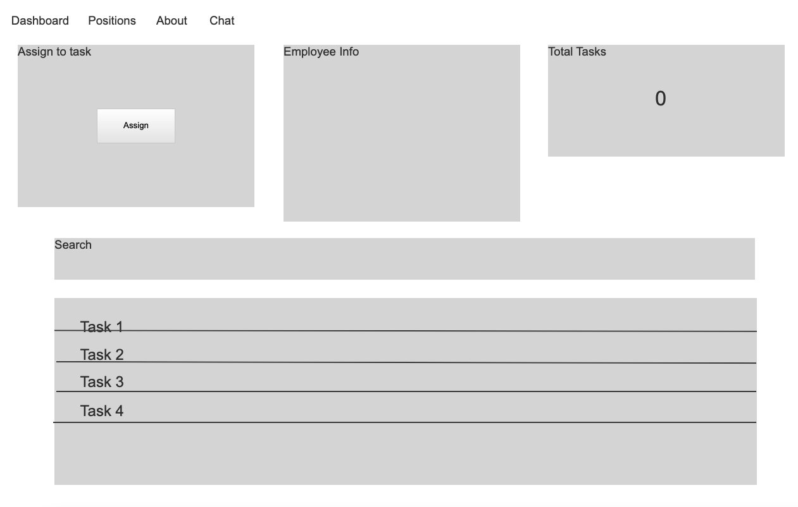
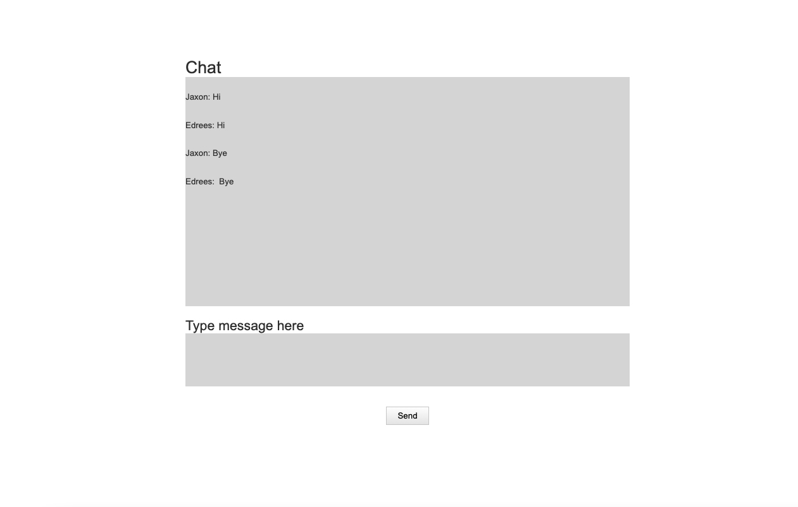

# Task Manager

A task managing program for employers to assign tasks to employees, manage the tasks they have assiged them, and chat directly with employees and managers. Targeted towards the resturant industry.

## Live [Site]()

## User Stories:

- As a `company` I want to be able assign tasks to employees, and have an open line of communication directly between employees and managers.

- As an `employee` I want to have a direct line of communication with my manager and other employees, and know what tasks have been assiged to me. 

## Features:

- Direct line of communication between employees and managers

- Two accounts: Managers, employees

- Assign tasks to employees

- Employees set status of tasks

- Know how many tasks have been assiged to employees and who has been assigned what

- Ability to search for tasks that have been assiged to employees

- List of positions that are in a company

## Logic for channels

```py
class ChatRoomConsumer(AsyncWebsocketConsumer):
    async def connect(self):
        self.room_name = self.scope['url_route']['kwargs']['room_name']
        self.room_group_name = 'chat_%s' % self.room_name

        # Creates a new group
        await self.channel_layer.group_add(
            self.room_group_name,
            self.channel_name
        )

        await self.accept()

    async def disconnect(self, close_code):
        await self.channel_layer.group_discard(
            self.room_group_name,
            self.channel_name
        )

    async def receive(self, text_data):
        text_data_json = json.loads(text_data)
        message = text_data_json['message']
        username = text_data_json['username']

        await self.channel_layer.group_send(
            self.room_group_name,
            {
                'type': 'chatroom_message',
                'message': message,
                'username': username,
            }
        )

    async def chatroom_message(self, event):
        message = event['message']
        username = event['username']

        await self.send(text_data=json.dumps({
            'message': message,
            'username': username,
        }))
```

## Permission checks 

```py
def unauthenticated_user(view_func):
	def wrapper_func(request, *args, **kwargs):
		if request.user.is_authenticated:
			return redirect('home')
		else:
			return view_func(request, *args, **kwargs)

	return wrapper_func

def allowed_users(allowed_roles=[]):
	def decorator(view_func):
		def wrapper_func(request, *args, **kwargs):

			group = None
			if request.user.groups.exists():
				group = request.user.groups.all()[0].name

			if group in allowed_roles:
				return view_func(request, *args, **kwargs)
			else:
				return HttpResponse('You are not authorized to view this page')
		return wrapper_func
	return decorator

def admin_only(view_func):
	def wrapper_function(request, *args, **kwargs):
		group = None
		if request.user.groups.exists():
			group = request.user.groups.all()[0].name

		if group == 'employees':
			return redirect('user-page')

		if group == 'admin':
			return view_func(request, *args, **kwargs)

	return wrapper_function
```

## Task Model

```py
class Task(models.Model):
    STATUS = (
        ('Pending', 'Pending'),
        ('In Progress', 'In Progress'),
        ('Complete', 'Complete')
    )
    PRIORITY = (
        ('Not Important', 'Not Important'),
        ('Important', 'Important'),
        ('Very Important', 'Very Important')
    )
    title = models.CharField(max_length=200, null=True)
    note = models.CharField(max_length=200, null=True, blank=True)
    date_assigned = models.DateTimeField(auto_now_add=True)
    date_due = models.CharField(max_length=200, null=True, blank=True)
    priority = models.CharField(max_length=200, null=True, choices=PRIORITY)
    status = models.CharField(max_length=200, null=True, choices=STATUS)
    employee = models.ForeignKey(
        Employee, null=True, on_delete=models.SET_NULL)

    def __str__(self):
        return self.title
```

## Stretch Goals

- A thrid admin account for overseeing manager work
- Admin can add managers to company
- A schedule for employees and managers to see when they work
- Ask employees how they are feeling before and after their shift and why the feel that way
- Facial recognition to log into account
- Request scheduling changes
- Pick up and release shifts 
- Inventory list for managers to keep up with inventory and have reminders when food is going bad
- Add database for channels to save messages between people in the company

## Installation

1. Fork and clone this repository
2. Run pip `install django django_filters channels redis`
3. Run `python manage.py runserver`

## Dependencies

- Bootstrap

- Django

- django_filters

- channels

- redis

- PostgreSQL

## ERD Model



## Wireframes







